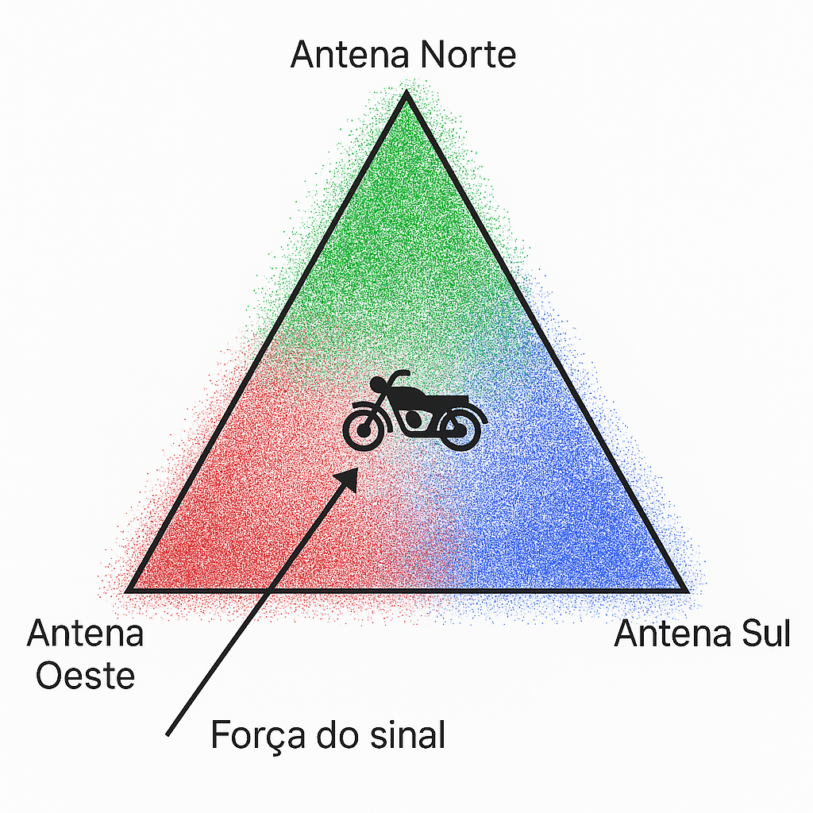

# $DEVOPS-TOOLS-CLOUD-COMPUTING$

## **👥 Integrantes**

|            NOME             |   RM   |
| :-------------------------: | :----: |
|  Francesco M Di Benedetto   | 557313 |
|   Samuel Patrick Yariwake   | 556461 |
| Luiz Felipe Campos da Silva | 555591 |

## **🎯 Objetivo**

### Rastrear uma moto no patio da MOTTU.

## **💡 Solução**

### Utilizar IOT para rastrear uma moto no patio da MOTTU, triangulando a localização com o uso de WIFI.

A proposta é usar **dispositivos IoT (como o ESP32)** para captar a intensidade de sinal de redes WiFi no entorno, mesmo sem conexão ativa, e assim **triangular a localização da moto** de forma estimada.

Com um custo aproximado de **R$ 50,00 por dispositivo**, conseguimos montar um sistema inteligente e acessível para monitoramento interno.

### 1. Uso de python com IA generativa para "_estimar_" a posição da moto.



### 2. API DOTNET para backend.

### 3. AZURE App Services

- Deploy da aplicação em nuvem para facilitar o acesso e escalabilidade.
- Application insights para métricas da aplicação.

## **🧱 Arquitetura**

.png>)

### _Fluxo_

1. IOT envia dado de `intensidade - Endereco MAC`.
2. API em DOTNET envia para o banco de dados NoSQL.
3. Desenvolvimento python lê os documentos e gera uma coordenada de localização no patio
4. Registro da posição no banco MySQL
5. Envio da posição para o front por meio da API DOTNET

## **🛠️ Recursos**

.png>)

## **🌐 Deploy**

### _Rodar o [Script de deploy](./script/deploy.sh)_

> Pode ser feito o deploy pelo Cloud Shell ou via terminal local caso tenha o Azure CLI

O script automatiza:

1. Criar o grupo de recursos
2. Cria o banco de dados MySQL
3. Cria o banco de dados Cosmos
4. Cria o Application Insights
5. Cria o Webapp
   - A aplicação já cria as tabelas no banco de dados via Migrations
   - Script DDL: [create_table.sql](./data/script_bd.sql)

### _Login no GITHUB_

Durante o deploy é solicitado o login.

Seria apenas liberar a permissão para a azure monitorar a branch e realizar o deploy automático após o commit.

### _Adição de secrets no github e no workflow_

O deploy/build pode ter um erro cano não tenha acesso ao banco de dados.

Solução seria adicionar as variáveis ao secrets do github e no workflow da azure.

### _Pronto_

Sim, está pronto o deploy.

- [🔗 WebApp](https://wa-challenge-mottu.azurewebsites.net)

## **🧪 Exemplos de testes da API**

### _Endpoints_

| Método | Rota                                            | Descrição                        |
| ------ | ----------------------------------------------- | -------------------------------- |
| GET    | **/api/[entidade]**                             | Retorna todos os registros       |
| GET    | **/api/[entidade]/paginado?pagina=[x]&qtd=[y]** | Retorna registros paginados      |
| GET    | **/api/[entidade]/{id}**                        | Retorna um único registro por ID |
| POST   | **/api/[entidade]**                             | Cria um novo registro            |
| PUT    | **/api/[entidade]/{id}**                        | Atualiza um registro existente   |
| DELETE | **/api/[entidade]/{id}**                        | Remove um registro existente     |

- `Registro Sinal` não tem PUT, já que não se pode adulterar um registro.

### _POST_

```json
{
  "idFilial": 2,
  "nomePatio": "01 - Base",
  "capacidadeMax": 100,
  "area": 100,
  "descricao": null
}
```

- Callback

```json
{
  "idPatio": 10,
  "idFilial": 2,
  "nomePatio": "01 - Base",
  "capacidadeMax": 100,
  "area": 100,
  "descricao": null,
  "receptorWifi": [],
  "_links": [
    {
      "rel": "self",
      "href": "/api/PatioApi/10",
      "method": "GET"
    },
    {
      "rel": "update",
      "href": "/api/PatioApi/10",
      "method": "PUT"
    },
    {
      "rel": "delete",
      "href": "/api/PatioApi/10",
      "method": "DELETE"
    }
  ]
}
```

### _PUT_

```json
{
  "idPatio": 10,
  "idFilial": 2,
  "nomePatio": "01 - Base",
  "capacidadeMax": 150,
  "area": 200,
  "descricao": "Patio principal"
}
```

### _outros_

- [exemplos de filial](./data/filial_test.json)
- [exemplos de patio](./data/patio_test.json)
- [exemplos de registro](./data/registro_test.json)
- [exemplos de wifi](./data/wifi_test.json)

## **🎥 Video**

[Clique aqui para assistir ](https://www.youtube.com/watch?v=gxX8JHUuLHE)

## **💻 Código Fonte**

[Repositório no GitHub](https://github.com/challenge-mottu/ADVANCED-BUSINESS-DEVELOPMENT-WITH-.NET)

